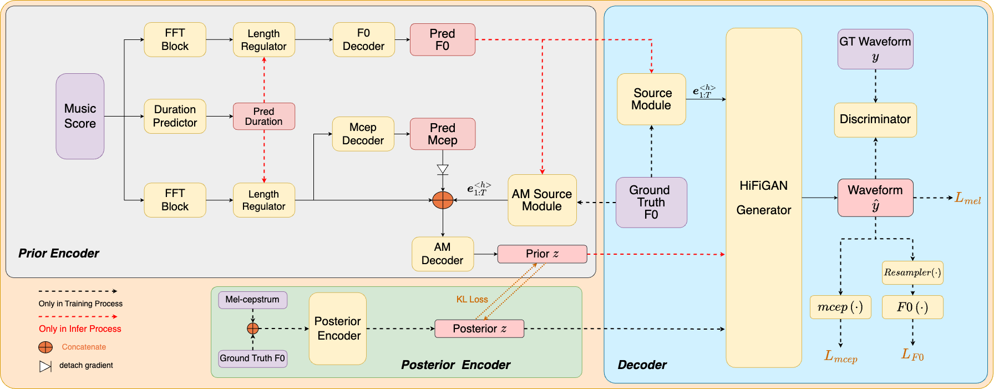

# 
 SiFiSinger: Source-filter based Singing Voice Synthesizer with Variational Autoencoder and Adversarial Learning

 

## Abstract	

 This paper presents an advanced end-to-end singing voice synthesis (SVS) system combining the source-filter mechanism which directly translates lyrical and melodic cues into expressive and high-fidelity human-like singing. Similar with other systems such as VISinger2, the proposed system also utilizes training paradigms evolved from VITS and incorporates elements like the fundamental pitch (F0) predictor and waveform generation decoder. To address a critical challenge that the coupling of mel-spectrogram features with F0 information that may introduce additional errors during F0 prediction, two primary solutions are proposed in this paper. Firstly, we leverage mel-cepstrum (mcep) features to decouple the intertwined mel-spectrogram and F0 characteristics.  Secondly, inspired by the neural source-filter models, we introduce source  excitation signals as the representation of F0 in SVS system, aiming to capture pitch nuances more accurately.  Meanwhile differentiable mcep and F0 losses are employed as the waveform decoder supervision to fortify the prediction accuracy of speech envelope and pitch in generated speech.Extensive experiments on the Opencpop dataset  demonstrate that our proposed model surpasses  VISinger2 predecessor in synthesis quality and intonation accuracy.
 
 

 

<table align="center">
  <thead>
    <tr>
      <th>System</th>
      <th>Demo1</th>
      <th>Demo2</th>
    </tr>
  </thead>
  <tbody>
    
   <tr>
      <td>GT (Recording) </td>
      <td><audio controls="" preload="auto">
            <source src="wavs/ground_truth/2044001639.wav"></audio></td>
       <td><audio controls="" preload="auto">
            <source src="wavs/ground_truth/2044001644.wav"></audio></td>
   </tr>

   <tr>
   <td>VISinger2 </td>
    <td><audio controls="" preload="auto">
            <source src="wavs/VISinger2/2044001639.wav"></audio></td>
    <td><audio controls="" preload="auto">
            <source src="wavs/VISinger2/2044001644.wav"></audio></td>
   </tr>

   <tr>
   <td>SiFiSinger-as </td>
    <td><audio controls="" preload="auto">
            <source src="wavs/SiFiSinger-as/2044001639.wav"></audio></td>
    <td><audio controls="" preload="auto">
            <source src="wavs/SiFiSinger-as/2044001644.wav"></audio></td>
   </tr>
   
   <tr>
   <td>SiFiSinger-ds </td>
    <td><audio controls="" preload="auto">
            <source src="wavs/SiFiSinger-ds/2044001639.wav"></audio></td>
    <td><audio controls="" preload="auto">
            <source src="wavs/SiFiSinger-ds/2044001644.wav"></audio></td>
   </tr>

   <tr>
   <td>SiFiSinger </td>
    <td><audio controls="" preload="auto">
            <source src="wavs/SiFiSinger/2044001639.wav"></audio></td>
    <td><audio controls="" preload="auto">
            <source src="wavs/SiFiSinger/2044001644.wav"></audio></td>
   </tr>
  </tbody>
</table>

 

<table align="center">
  <thead>
    <tr>
      <th>System</th>
      <th>Demo3</th>
      <th>Demo4</th>
    </tr>
  </thead>
  <tbody>
    
   <tr>
      <td>GT (Recording) </td>
      <td><audio controls="" preload="auto">
            <source src="wavs/ground_truth/2086003187.wav"></audio></td>
       <td><audio controls="" preload="auto">
            <source src="wavs/ground_truth/2086003200.wav"></audio></td>
   </tr>

   <tr>
   <td>VISinger2 </td>
    <td><audio controls="" preload="auto">
            <source src="wavs/VISinger2/2086003187.wav"></audio></td>
    <td><audio controls="" preload="auto">
            <source src="wavs/VISinger2/2086003200.wav"></audio></td>
   </tr>

   <tr>
   <td>SiFiSinger-as </td>
    <td><audio controls="" preload="auto">
            <source src="wavs/SiFiSinger-as/2086003187.wav"></audio></td>
    <td><audio controls="" preload="auto">
            <source src="wavs/SiFiSinger-as/2086003200.wav"></audio></td>
   </tr>
   
   <tr>
   <td>SiFiSinger-ds </td>
    <td><audio controls="" preload="auto">
            <source src="wavs/SiFiSinger-ds/2086003187.wav"></audio></td>
    <td><audio controls="" preload="auto">
            <source src="wavs/SiFiSinger-ds/2086003200.wav"></audio></td>
   </tr>

   <tr>
   <td>SiFiSinger </td>
    <td><audio controls="" preload="auto">
            <source src="wavs/SiFiSinger/2086003187.wav"></audio></td>
    <td><audio controls="" preload="auto">
            <source src="wavs/SiFiSinger/2086003200.wav"></audio></td>
   </tr>
  </tbody>
</table>

 

<table align="center">
  <thead>
    <tr>
      <th>System</th>
      <th>Demo5</th>
      <th>Demo6</th>
    </tr>
  </thead>
  <tbody>
    
   <tr>
      <td>GT (Recording) </td>
      <td><audio controls="" preload="auto">
            <source src="wavs/ground_truth/2092003420.wav"></audio></td>
       <td><audio controls="" preload="auto">
            <source src="wavs/ground_truth/2093003464.wav"></audio></td>
   </tr>

   <tr>
   <td>VISinger2 </td>
    <td><audio controls="" preload="auto">
            <source src="wavs/VISinger2/2092003420.wav"></audio></td>
    <td><audio controls="" preload="auto">
            <source src="wavs/VISinger2/2093003464.wav"></audio></td>
   </tr>

   <tr>
   <td>SiFiSinger-as </td>
    <td><audio controls="" preload="auto">
            <source src="wavs/SiFiSinger-as/2092003420.wav"></audio></td>
    <td><audio controls="" preload="auto">
            <source src="wavs/SiFiSinger-as/2093003464.wav"></audio></td>
   </tr>
   
   <tr>
   <td>SiFiSinger-ds </td>
    <td><audio controls="" preload="auto">
            <source src="wavs/SiFiSinger-ds/2092003420.wav"></audio></td>
    <td><audio controls="" preload="auto">
            <source src="wavs/SiFiSinger-ds/2093003464.wav"></audio></td>
   </tr>

   <tr>
   <td>SiFiSinger </td>
    <td><audio controls="" preload="auto">
            <source src="wavs/SiFiSinger/2092003420.wav"></audio></td>
    <td><audio controls="" preload="auto">
            <source src="wavs/SiFiSinger/2093003464.wav"></audio></td>
   </tr>
  </tbody>
</table>

<table align="center">
  <thead>
    <tr>
      <th>System</th>
      <th>Demo7</th>
      <th>Demo8</th>
    </tr>
  </thead>
  <tbody>
    
   <tr>
      <td>GT (Recording) </td>
      <td><audio controls="" preload="auto">
            <source src="wavs/ground_truth/2093003472.wav"></audio></td>
       <td><audio controls="" preload="auto">
            <source src="wavs/ground_truth/2100003713.wav"></audio></td>
   </tr>

   <tr>
   <td>VISinger2 </td>
    <td><audio controls="" preload="auto">
            <source src="wavs/VISinger2/2093003472.wav"></audio></td>
    <td><audio controls="" preload="auto">
            <source src="wavs/VISinger2/2100003713.wav"></audio></td>
   </tr>

   <tr>
   <td>SiFiSinger-as </td>
    <td><audio controls="" preload="auto">
            <source src="wavs/SiFiSinger-as/2093003472.wav"></audio></td>
    <td><audio controls="" preload="auto">
            <source src="wavs/SiFiSinger-as/2100003713.wav"></audio></td>
   </tr>
   
   <tr>
   <td>SiFiSinger-ds </td>
    <td><audio controls="" preload="auto">
            <source src="wavs/SiFiSinger-ds/2093003472.wav"></audio></td>
    <td><audio controls="" preload="auto">
            <source src="wavs/SiFiSinger-ds/2100003713.wav"></audio></td>
   </tr>

   <tr>
   <td>SiFiSinger </td>
    <td><audio controls="" preload="auto">
            <source src="wavs/SiFiSinger/2093003472.wav"></audio></td>
    <td><audio controls="" preload="auto">
            <source src="wavs/SiFiSinger/2100003713.wav"></audio></td>
   </tr>
  </tbody>
</table>

 

<table align="center">
  <thead>
    <tr>
      <th>System</th>
      <th>Demo9</th>
      <th>Demo10</th>
    </tr>
  </thead>
  <tbody>
    
   <tr>
      <td>GT (Recording) </td>
      <td><audio controls="" preload="auto">
            <source src="wavs/ground_truth/2100003724.wav"></audio></td>
       <td><audio controls="" preload="auto">
            <source src="wavs/ground_truth/2100003728.wav"></audio></td>
   </tr>

   <tr>
   <td>VISinger2 </td>
    <td><audio controls="" preload="auto">
            <source src="wavs/VISinger2/2100003724.wav"></audio></td>
    <td><audio controls="" preload="auto">
            <source src="wavs/VISinger2/2100003728.wav"></audio></td>
   </tr>

   <tr>
   <td>SiFiSinger-as </td>
    <td><audio controls="" preload="auto">
            <source src="wavs/SiFiSinger-as/2100003724.wav"></audio></td>
    <td><audio controls="" preload="auto">
            <source src="wavs/SiFiSinger-as/2100003728.wav"></audio></td>
   </tr>
   
   <tr>
   <td>SiFiSinger-ds </td>
    <td><audio controls="" preload="auto">
            <source src="wavs/SiFiSinger-ds/2100003724.wav"></audio></td>
    <td><audio controls="" preload="auto">
            <source src="wavs/SiFiSinger-ds/2100003728.wav"></audio></td>
   </tr>

   <tr>
   <td>SiFiSinger </td>
    <td><audio controls="" preload="auto">
            <source src="wavs/SiFiSinger/2100003724.wav"></audio></td>
    <td><audio controls="" preload="auto">
            <source src="wavs/SiFiSinger/2100003728.wav"></audio></td>
   </tr>
  </tbody>
</table>

 

<table align="center">
  <thead>
    <tr>
      <th>System</th>
      <th>Demo11</th>
      <th>Demo12</th>
    </tr>
  </thead>
  <tbody>
    
   <tr>
      <td>GT (Recording) </td>
      <td><audio controls="" preload="auto">
            <source src="wavs/ground_truth/2100003734.wav"></audio></td>
       <td><audio controls="" preload="auto">
            <source src="wavs/ground_truth/2100003740.wav"></audio></td>
   </tr>

   <tr>
   <td>VISinger2 </td>
    <td><audio controls="" preload="auto">
            <source src="wavs/VISinger2/2100003734.wav"></audio></td>
    <td><audio controls="" preload="auto">
            <source src="wavs/VISinger2/2100003740.wav"></audio></td>
   </tr>

   <tr>
   <td>SiFiSinger-as </td>
    <td><audio controls="" preload="auto">
            <source src="wavs/SiFiSinger-as/2100003734.wav"></audio></td>
    <td><audio controls="" preload="auto">
            <source src="wavs/SiFiSinger-as/2100003740.wav"></audio></td>
   </tr>
   
   <tr>
   <td>SiFiSinger-ds </td>
    <td><audio controls="" preload="auto">
            <source src="wavs/SiFiSinger-ds/2100003734.wav"></audio></td>
    <td><audio controls="" preload="auto">
            <source src="wavs/SiFiSinger-ds/2100003740.wav"></audio></td>
   </tr>

   <tr>
   <td>SiFiSinger </td>
    <td><audio controls="" preload="auto">
            <source src="wavs/SiFiSinger/2100003734.wav"></audio></td>
    <td><audio controls="" preload="auto">
            <source src="wavs/SiFiSinger/2100003740.wav"></audio></td>
   </tr>
  </tbody>
</table>

 

<table align="center">
  <thead>
    <tr>
      <th>System</th>
      <th>Demo13</th>
      <th>Demo14</th>
    </tr>
  </thead>
  <tbody>
    
   <tr>
      <td>GT (Recording) </td>
      <td><audio controls="" preload="auto">
            <source src="wavs/ground_truth/2100003749.wav"></audio></td>
       <td><audio controls="" preload="auto">
            <source src="wavs/ground_truth/2100003755.wav"></audio></td>
   </tr>

   <tr>
   <td>VISinger2 </td>
    <td><audio controls="" preload="auto">
            <source src="wavs/VISinger2/2100003749.wav"></audio></td>
    <td><audio controls="" preload="auto">
            <source src="wavs/VISinger2/2100003755.wav"></audio></td>
   </tr>

   <tr>
   <td>SiFiSinger-as </td>
    <td><audio controls="" preload="auto">
            <source src="wavs/SiFiSinger-as/2100003749.wav"></audio></td>
    <td><audio controls="" preload="auto">
            <source src="wavs/SiFiSinger-as/2100003755.wav"></audio></td>
   </tr>
   
   <tr>
   <td>SiFiSinger-ds </td>
    <td><audio controls="" preload="auto">
            <source src="wavs/SiFiSinger-ds/2100003749.wav"></audio></td>
    <td><audio controls="" preload="auto">
            <source src="wavs/SiFiSinger-ds/2100003755.wav"></audio></td>
   </tr>

   <tr>
   <td>SiFiSinger </td>
    <td><audio controls="" preload="auto">
            <source src="wavs/SiFiSinger/2100003749.wav"></audio></td>
    <td><audio controls="" preload="auto">
            <source src="wavs/SiFiSinger/2100003755.wav"></audio></td>
   </tr>
  </tbody>
</table>
